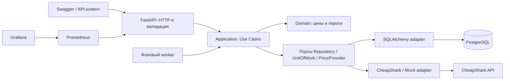

# Архитектура и Use Case

Game Radar — API для поиска игр, списка желаемого, истории наблюдавшихся цен и
журнала событий о достижении желаемой цены. Все суммы хранятся как Decimal и
возвращаются строками; валюта — USD. `steam_only=true` выбирает предложения
магазина Steam (`store_id=1`). Цены в USD не являются региональными ценами Steam.

## Границы ответственности

- `app/domain`: сущности и чистые правила расчёта цены, порога и сводки. Слой
  не зависит от FastAPI, HTTP или SQLAlchemy.
- `app/application`: сценарии приложения и порты. Use Case выполняет одну
  бизнес-операцию, обращается к репозиторию и провайдеру через интерфейсы,
  управляет фиксацией изменений.
- `app/infrastructure`: реализация репозиториев и Unit of Work через SQLAlchemy.
- `app/providers.py`: адаптер CheapShark и автономный MockProvider.
- API переводит HTTP-запросы в вызовы Use Case, проверяет ключ и преобразует
  результаты/ошибки в JSON и HTTP-коды. Worker использует те же сценарии.

Например, добавление игры в wishlist проходит через: валидацию `game_id` и
порога → поиск wishlist → получение актуальных предложений через порт провайдера
или кэш → сохранение игры, снимков цен и элемента wishlist → проверку порога →
фиксацию события при переходе в состояние «порог достигнут» → commit.

Транспорт не содержит расчёт цены. Правило выбора лучшего предложения можно
проверять без HTTP и базы; целый сценарий — с подменяемыми портами. Интеграционные
тесты API используют отдельную SQLite в памяти, а production — PostgreSQL.

## Данные и внешняя интеграция

База хранит игры, текущие предложения, снимки цен, wishlist, элементы и журнал
событий. Поиск не восстанавливает старую историю: она начинается с наблюдений
этого сервиса. Повторное чтение кэша не считается новым наблюдением.

CheapShark используется через фиксированный базовый адрес, timeout и ограничение
частоты; строки поиска не становятся URL. При временной недоступности интеграции
API возвращает контролируемую ошибку. Режим `mock` полностью автономен и нужен
для разработки, автотестов и нагрузки. Источник явно отражается в ответах.
Документация провайдера: <https://apidocs.cheapshark.com/>.

Журнал уведомлений доступен через API. Отправка в Telegram отложена и не
реализована. Повторная проверка неизменившегося сработавшего порога не создаёт
новое событие; новое пересечение порога может создать следующее.

## Эксплуатация

API и worker запускаются отдельно, работают с одной PostgreSQL и одним образом.
Схема управляется Alembic. Healthcheck проверяет доступность БД; `/metrics`
показывает метрики HTTP, Prometheus собирает их, Grafana отображает нагрузку.

Jenkins на первой машине проверяет код, собирает образ, сканирует его Trivy и
публикует с тегом коммита. Вторая машина получает готовый образ. Нагрузочный
генератор находится на первой машине, а отдельный mock-сервис для нагрузки —
на второй. Его PostgreSQL, exporter, Prometheus/Grafana и тома отделены от
рабочего стека; перед очисткой Jenkins сохраняет временные ряды нагрузки.
Откат выбирает прежний неизменяемый тег образа.

Дополнительные модули: Trivy и резервное копирование PostgreSQL по расписанию.
Восстановление демонстрируется в отдельной тестовой БД. Состав исходников не
заменяет доказательства работающей инфраструктуры: их фиксируют на защите.

## Текущие ограничения

Общий `X-API-Key` рассчитан на учебное развёртывание: отдельные пользователи,
вход и разграничение доступа между владельцами wishlist пока не реализованы.
API и панели мониторинга следует открывать в согласованной локальной сети.
Реальные цены зависят от обновления CheapShark. Mock-цены вымышленные.
