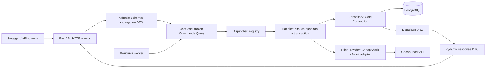

# Архитектура и Use Case

Game Radar — API для поиска игр, wishlist, истории наблюдавшихся цен и журнала
срабатывания порогов. Все суммы хранятся как Decimal и возвращаются строками;
валюта — USD. `steam_only=true` выбирает предложения Steam (`store_id=1`).
Цены в USD не являются региональными ценами Steam.

Архитектура уточнена 7 октября 2026 года по требованиям Use Case Pattern:
Use Case содержит только данные команды или запроса, Handler выполняет
бизнес-операцию, Repository обращается к БД через SQLAlchemy Core.



## Границы ответственности

| Слой | Ответственность | Чего в нём нет |
| --- | --- | --- |
| `app/api` | HTTP, авторизация, построение Use Case и сериализация ответа | SQL-запросов и бизнес-правил |
| `app/schemas` | Pydantic request/response DTO, проверка данных и aliases | SQLAlchemy-моделей и транзакций |
| `app/usecases` | Frozen dataclass-команды и запросы с данными операции | Выполнения операции, зависимостей и SQL |
| `app/dispatcher.py` | Реестр обработчиков и выбор Handler по типу Use Case | Предметной логики |
| `app/dependencies/dispatcher_register.py` | DispatcherRegistrar, создание зависимостей и регистрация `.handle` | SQL-запросов и правил расчёта |
| `app/usecase_handlers` | Проверка состояния, выбор цены, пороги, работа с адаптером и транзакции | Зависимости от FastAPI |
| `app/services` | Общий GameRefreshService и повторно используемая предметная логика | HTTP-ответов и самостоятельных commit |
| `app/repositories` | Core `select/insert/update/delete`, `Connection.execute`, маппинг строк в Views | `commit`, `rollback`, Pydantic и ORM Session |
| `app/adapters` | Порт получения цен, CheapShark и автономный mock | HTTP-ответов и транзакций БД |
| `app/models` | SQLAlchemy Table/MetaData | Поведения бизнес-объектов |
| `app/domain/entities.py` | Dataclass Views результатов чтения и значения предметной области | Валидации HTTP и ORM-сессии |

`app/domain/pricing.py` содержит чистые вычисления цены, порога и сводки,
которые использует Handler. `app/mappers/responses.py` отображает Views в
response DTO; `app/repositories/mapping.py` отображает Core-строки в Views.

`app/models/tables.py` описывает таблицы, а `app/models/__init__.py` экспортирует
metadata и их имена. `RepositorySet(connection)` создаёт репозитории для одного
Connection; методы репозиториев не завершают транзакции. Маппинг строк в Views
находится отдельно от Pydantic DTO.

Имена контрактов заканчиваются на `UseCase`, например `AddWatchlistItemUseCase`.
Контракты одного домена сгруппированы в `app/usecases/<domain>.py`; каждый
обработчик размещён в `app/usecase_handlers/<domain>/<action>.py`. Registrar
создаёт общие сервисы и связывает тип команды с методом `Handler.handle`.

`scripts/generate_models.py` использует sqlacodegen 3.2.0 для генерации Core-описания
таблиц. Режим по `DATABASE_URL` отражает уже мигрированную БД; автономный
`--from-migration` строит описание по исходной миграции. Alembic управляет
изменениями схемы; генерация не заменяет миграции. Генерация по миграции не
является доказательством интроспекции работающей PostgreSQL.

Текущий `tables.py` сгенерирован автономно из объектов схемы исходной миграции
`f56047282f20`. Проверено соответствие типов PostgreSQL, индексов и ограничений
этой миграции, а также upgrade и сравнение metadata в отдельной SQLite.

```powershell
uv run python scripts/generate_models.py --from-migration
# Для отражения уже мигрированной БД настройте DATABASE_URL:
uv run python scripts/generate_models.py
```

## Поток операции и транзакция

Например, добавление игры в wishlist проходит так:

1. FastAPI проверяет ключ; Pydantic валидирует идентификатор, цену и Steam-фильтр.
2. Контроллер создаёт frozen-команду добавления и передаёт её Dispatcher.
3. Dispatcher выбирает зарегистрированный Handler.
4. Handler открывает `connection.begin()`, проверяет wishlist и отсутствие
   дубликата, получает предложения из кэша либо обновляет их через PriceProvider.
5. Repository выполняет Core-запросы в Connection этой транзакции. Снимки сохраняются только при
   обновлении цен; добавление из свежего кэша новых снимков не создаёт.
6. Handler сохраняет элемент, проверяет порог и создаёт событие при переходе
   в состояние «порог достигнут». Контекст транзакции фиксирует успех или
   откатывает изменения при исключении.
7. Результат отображается в dataclass View и Pydantic response DTO, затем в JSON.

Одна транзакция согласованно меняет несколько таблиц. Контроллер, Dispatcher
и Repository не вызывают commit. Worker строит команды и использует тот же
Dispatcher и обработчики.

Обновление и изменение элементов соблюдают порядок блокировок PostgreSQL:
игра → родительские wishlist (`FOR KEY SHARE`) → элементы wishlist
(`FOR UPDATE`). Родительские строки берутся до дочерних, чтобы каскадное
удаление списка не образовывало цикл ожидания с обновлением цены.
Конкурентная проверка обнаружила `40P01` до этого исправления; транзакция
откатилась, данные остались согласованы. Повторный детерминированный тест
исправленной сборки подтвердил защиту родителя, ожидание DELETE, успешность
обоих Handler и `deadlock=false`. Воспроизводимые проверки находятся в
`scripts/verify_postgres.py` и `scripts/verify_pg_delete_race.py`; они используют
mock и очищают только свои временные записи.

Входные DTO принимают `snake_case` и совместимые aliases `camelCase`, например
`game_id`/`gameId`, `target_price`/`targetPrice`, `steam_only`/`steamOnly`.
Ответы API используют только `camelCase`. Decimal-цены остаются строками.
Согласованный [OpenAPI 3.1.0 контракт](../doc/game-radar-api.yaml) — источник
схем; `scripts/generate_schemas.py` генерирует Pydantic v2 модели в
`app/schemas/game_radar_api.py`. Ошибки возвращаются как Problem Details,
ошибки валидации — ValidationProblemDetails. Значения входных данных и ключи
не включаются в безопасный JSON-журнал запросов.
`SettingsConfigDict(hide_input_in_errors=True)` скрывает значения конфигурации
в тексте ошибок валидации при запуске; это проверено регрессионным тестом.

## Данные и внешняя интеграция

База хранит игры, текущие предложения, снимки цен, wishlist, элементы и журнал.
История начинается с наблюдений сервиса: чтение кэша не является новым
наблюдением. Повторная проверка достигнутого порога не создаёт дубликат;
после выхода из этого состояния новое пересечение создаёт событие.

Сводка может иметь `source=mixed`, если после смены режима список содержит
наблюдения разных источников. Источник каждой игры и снимка сохраняется;
health отражает текущую настройку провайдера.

CheapShark вызывается по фиксированному адресу с timeout и ограничением частоты.
Отказ интеграции преобразуется в контролируемую HTTP-ошибку через API. Режим
`mock` автономен для разработки, тестов и нагрузки; источник отражается
в ответах. Документация: <https://apidocs.cheapshark.com/>. Доставка событий
в Telegram отложена; работает журнал в БД/API.

## Эксплуатация и доказательства

API и worker — отдельные процессы с одной PostgreSQL и одним образом. Alembic
управляет схемой; healthcheck проверяет БД, Prometheus собирает HTTP-метрики,
Grafana отображает их. Jenkins на первой машине должен проверить код, собрать
и просканировать образ, опубликовать тег коммита и развёрнуть его на второй.
JMeter также расположен на первой машине. Его mock-стек на второй имеет
собственные БД, тома и мониторинг. Дополнительные модули — Trivy и backup/restore.

[Локальные результаты 6 октября](local-verification.md) относятся к версии
до перехода на Core/Dispatcher/Handler. Они сохраняются как исходные измерения,
а проверки изменённого backend фиксируются отдельно. 7 октября пройдены
134 теста, Ruff, проверка воспроизводимости Pydantic/Core-кодогенерации,
HTTP smoke и конкуренция новой сборки, Alembic check на PostgreSQL, Trivy
с 0 CRITICAL и повторный короткий JMeter: 338 запросов, 0 ошибок, p95 26 мс.
Предыдущие backup/restore и измерения не переносятся на новую сборку автоматически.
Полный pipeline на двух машинах, нагрузка до
насыщения и rollback остаются планом демонстрации.

Общий `X-API-Key` предназначен для учебного развёртывания. Отдельные пользователи
и разграничение доступа между владельцами wishlist пока не реализованы.
Mock-цены вымышленные; реальные предложения зависят от обновления CheapShark.

После проверки рабочие и нагрузочные сервисы остановлены. Постоянные тома
основного проекта сохранены, временные тома нагрузки удалены.
